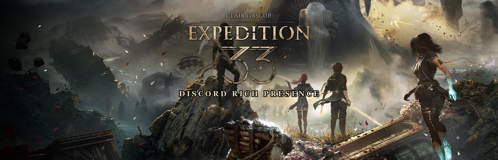
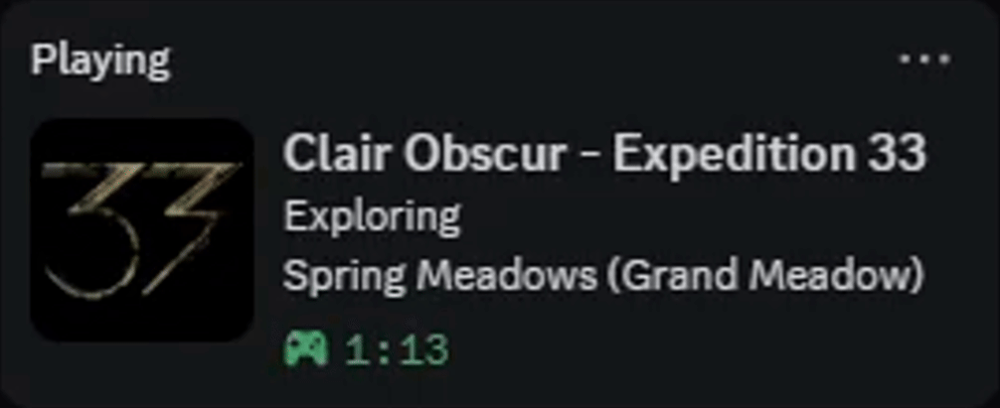

<p align="center">
  
</p>

<h1 align="center">Clair Obscur: Expedition 33 — Discord Rich Presence</h1>

<p align="center">
  <strong>An autonomous, lightweight Windows companion bringing rich, real-time dynamic presence for <em>Clair Obscur: Expedition 33</em> directly to your Discord profile.</strong>
</p>

<p align="center">
  <a href="https://github.com/SolaneHub/Expedition33_RPC/releases"></a>
  <a href="https://www.python.org/"></a>
  <a href="https://www.microsoft.com/windows"></a>
  <a href="https://github.com/astral-sh/ruff"></a>
  <a href="https://github.com/microsoft/pyright"></a>
  <a href="LICENSE"></a>
  <a href="#security"></a>
</p>

<p align="center">
  <a href="https://github.com/SolaneHub/Expedition33_RPC/releases/latest/download/Expedition33_RPC.exe">
    
  </a>
  <br>
  <a href="https://github.com/SolaneHub/Expedition33_RPC/releases">
    
  </a>
</p>

<p align="center">
  <a href="#showcase">Showcase</a> •
  <a href="#features">Key Features</a> •
  <a href="#presence-matrix">Presence Matrix</a> •
  <a href="#quick-start">Quick Start</a> •
  <a href="#tray-controls">Tray Controls</a> •
  <a href="#architecture">Architecture</a> •
  <a href="#security">Security</a> •
  <a href="#issues">Issues & Feedback</a> •
  <a href="#license">License</a>
</p>

---

<h2 id="showcase">🎬 Discord Status Showcase</h2>

| Exploration & Combat | Endless Tower Trials | Anti-Spoiler Shield |
| :---: | :---: | :---: |
|  |  |  |
| Live dynamic transition from zone exploration (`Spring Meadows`) to turn-based battle (`Fighting: Lancelier`). | Real-time stage and trial progression (`Stage 1, Trial 1`) with multi-enemy encounter targeting. | Instant one-click tray shield masking locations (`Hidden Location`) and encounters (`In Combat`). |

---

<h2 id="features">✨ Key Features</h2>

- **Continuous Autonomous Detection**: Runs quietly in the system tray and establishes a Discord Rich Presence session the moment `SandFall-Win64-Shipping.exe` begins running, cleanly disconnecting when the game closes.
- **Dual-Engine Detection Pipeline**:
  - **Tier 1 (Real-Time Game Thread Bridge)**: A headless, non-intrusive Lua bridge powered by [UE4SS](https://github.com/UE4SS-RE/RE-UE4SS) that hooks directly into `AC_jRPG_BattleManager_C` on the game thread. Detects battle transitions in 0 milliseconds and extracts live enemy/boss titles without memory scanning.
  - **Tier 2 (Binary Save File Parser)**: Reads `SavesContainer.sav` and `EXPEDITION_0.sav` with multi-tier fuzzy zone validation as a fallback whenever the bridge is not active.
- **Exhaustive Expedition Flag Mapping**: All **115 official in-game Expedition Flags** across **48 zones** (from *Spring Meadows* to *The Monolith*, *Verso's Drafts*, and *The Reacher*) are mapped with sub-area disambiguation and multi-tier resolution.
- **Official Zone Normalization**: Translates raw internal Unreal Engine map assets (`Level_Goblu_Main` -> *Flying Waters*, `Level_SeaCliff` -> *Stone Wave Cliffs*, `Level_CleasFlyingHouse` -> *Flying Manor*, `Level_SimonArea` -> *The Abyss*) into clean player-facing names.
- **Endless Tower & Super Boss Intelligence**: Automatically resolves trials, stages, and Super Bosses (*Simon the Divergent Star*, *Clea Unleashed*, *Duollistes*, *Painted Love*).
- **Unified Anti-Spoiler Mode**: One-click tray toggle to shield against spoilers when streaming or playing with friends.
- **Built-In Silent Auto-Updater**: Checks GitHub Releases API in the background on startup, verifies SHA-256 integrity, and performs a 100% invisible in-place self-update with automatic app restart via a native Windows PowerShell trampoline.
- **Windows Startup Integration**: Toggle automatic launch on Windows startup directly from the tray icon (`HKCU\...\Run`).

---

<h2 id="presence-matrix">🎮 What Appears on Your Discord Profile</h2>

The status adjusts dynamically depending on whether your game language is set to **English** or **Italian**:

| State | Details (Top Line) | State (Bottom Line) | Image Tooltip | Elapsed Timer |
| :--- | :--- | :--- | :--- | :--- |
| **Exploration (EN)** | `Exploring` | `<Zone Name> (<Flag Name>)` *(e.g. `Sirene (Dancing Classes)`)* | `Clair Obscur: Expedition 33` | Active session duration |
| **Exploration (IT)** | `In esplorazione` | `<Nome Zona> (<Nome Bandiera>)` *(es. `Sirène (Dancing Classes)`)* | `Clair Obscur: Expedition 33` | Durata sessione attiva |
| **Combat Encounter (EN)** | `Fighting: <Enemy / Boss>` | `<Zone Name> (<Flag Name>)` | `Clair Obscur: Expedition 33` | Active session duration |
| **Combat Encounter (IT)** | `In combattimento con: <Nemico>` | `<Nome Zona> (<Nome Bandiera>)` | `Clair Obscur: Expedition 33` | Durata sessione attiva |
| **Endless Tower (EN)** | `Fighting: <Boss / Enemy>` | `Endless Tower (Stage <X>, Trial <Y>)` | `Clair Obscur: Expedition 33` | Active session duration |
| **Endless Tower (IT)** | `In combattimento con: <Boss>` | `Torre Infinita (Fase <X>, Prova <Y>)` | `Clair Obscur: Expedition 33` | Durata sessione attiva |
| **Anti-Spoiler Enabled** | `In Combat` / `In combattimento` | `Hidden Location` / `Posizione riservata` | `Clair Obscur: Expedition 33` | Active session duration |

> [!TIP]
> **Process PID Binding**: The Discord Rich Presence client is bound directly to the live game executable (`SandFall-Win64-Shipping.exe`). Discord attaches your custom Rich Presence status directly to the running game instance, preventing conflicting dual statuses.

---

<h2 id="quick-start">🚀 Quick Start</h2>

1. **Download**: Grab the latest [Expedition33_RPC.exe](https://github.com/SolaneHub/Expedition33_RPC/releases/latest/download/Expedition33_RPC.exe) from Releases.
2. **Launch**: Double-click `Expedition33_RPC.exe`. It runs discreetly in your Windows system tray near the clock.
3. **Play**: Start *Clair Obscur: Expedition 33*. Your Discord Rich Presence updates immediately.

---

<h2 id="tray-controls">🎛️ System Tray Controls</h2>

Right-clicking the tray icon gives you full control and real-time diagnostic status:

| Menu Option | Description |
| :--- | :--- |
| `Game: Running (PID: X) / Not running` | Live status and process ID of the game executable |
| `Location: <Zone Name>` | Current map/zone (`[Hidden - Anti-Spoiler]` when enabled) |
| `Status: In Combat / Exploring` | Real-time combat state and active target name |
| `Discord: Connected / Standby` | Discord IPC pipe connection status |
| `Anti-Spoiler Mode [Enabled / Disabled]` | Toggles obscuring enemy names and location zones |
| `Combat Bridge [Installed / Install Now]` | Toggles deployment of the headless UE4SS combat bridge |
| `Start with Windows [X / ]` | Toggles automatic launch on Windows login via registry |
| `Check for Updates` / `Update to vX.X.X` | Checks for releases and applies one-click self-update |
| `Exit` | Disconnects Discord RPC and terminates the background process |

---

<h2 id="architecture">🏛️ Technical Architecture</h2>

The codebase follows a clean, modular 4-tier architecture designed for high maintainability, separation of concerns, and full static type safety:

```text
src/expedition33_rpc/
├── __init__.py               # Re-exports GameDetector, GameState, main, __version__
├── __main__.py               # CLI entrypoint (`python -m expedition33_rpc`)
│
├── core/                     # Application lifecycle, settings & system startup
│   ├── app.py                # Main loop, single-instance mutex & event orchestration
│   ├── settings.py           # Persistent configuration management (Anti-Spoiler)
│   └── startup.py            # Windows Registry autostart integration
│
├── detection/                # Game process, memory, save files & zone tracking
│   ├── detector.py           # GameDetector with polymorphic state providers
│   ├── game_data.py          # 115 Expedition Flags, zone overrides & trial tables
│   ├── save_reader.py        # Binary Unreal Engine .sav file reader & validator
│   └── timer_tracker.py      # ZoneTimerTracker for smooth timer persistence
│
├── integrations/             # External services & installers
│   ├── discord_rpc.py        # Discord Rich Presence manager via pypresence IPC
│   ├── bridge_installer.py   # Automatic UE4SS combat bridge deployment
│   └── updater.py            # In-app silent updater with SHA-256 verification
│
├── ui/                       # Graphical user interface
│   └── tray_app.py           # Windows System Tray icon, menu & notifications
│
└── assets/                   # Static resources
    ├── bridge.zip            # Pre-compiled headless UE4SS mod package
    ├── icon.ico              # Windows executable icon
    └── icon.png              # System tray & notification icon
```

---

<h2 id="security">🔒 Security, Verification & Antivirus Transparency</h2>

All binaries published under [Releases](https://github.com/SolaneHub/Expedition33_RPC/releases) are built automatically in isolated, clean virtual machines via GitHub Actions (see [.github/workflows/release.yml](.github/workflows/release.yml)). We provide complete, unedited transparency regarding security scans, checksums, and false positives.

### 🛡️ Live VirusTotal Analysis Reports

During every automated release build, all compiled artifacts are submitted directly to [VirusTotal](https://www.virustotal.com/) and scanned by 70+ industry security vendors. You can inspect the permanent public reports for the latest release:

| Release Artifact | SHA-256 Checksum | Detection Ratio | Permanent VirusTotal Report |
| :--- | :--- | :---: | :---: |
| **`Expedition33_RPC.exe`** | `65214d1674fa0881fef3d449094dd06fc52a9c523ab15409bab39e17f3ede225` | **66 / 71 Clean** *(5 Heuristic / ML Flags)* | [**Inspect Full Report**](https://www.virustotal.com/gui/file/65214d1674fa0881fef3d449094dd06fc52a9c523ab15409bab39e17f3ede225?nocache=1) |
| **`bridge.zip`** | `1a4a6c06f5a2a4d973b0baeb10a38f072ee934d2f175de882071084831194c8a` | **67 / 68 Clean** *(1 Generic Flag)* | [**Inspect Full Report**](https://www.virustotal.com/gui/file/1a4a6c06f5a2a4d973b0baeb10a38f072ee934d2f175de882071084831194c8a?nocache=1) |

> [!NOTE]
> **Zero Threats Detected by Leading Vendors**: The vast majority of top-tier antivirus suites — including **Kaspersky, Bitdefender, Avast, AVG, ESET-NOD32, Sophos, CrowdStrike Falcon, Symantec, and TrendMicro** — confirm that all binaries are **100% clean and undetected**.

---

### 🔍 Technical Breakdown of False Positives

If your antivirus or Windows SmartScreen displays an alert, here is exactly why it happens and why the binaries are safe:

#### 1. Why `Expedition33_RPC.exe` shows 5 heuristic detections:
- **Microsoft Defender (`Trojan:Win32/Wacatac.B!ml`)**:
  - The **`!ml`** suffix stands explicitly for **Machine Learning** — this is an automated cloud heuristic guess, not a known virus signature match.
  - `Expedition33_RPC` is packaged using **PyInstaller**, which bundles Python 3.10 and dependencies into a self-extracting executable. Because some malware authors also package malicious scripts using packers, automated cloud ML heuristics frequently misclassify fresh, unsigned PyInstaller binaries under generic names like `Wacatac.B!ml`.
- **Static AI / Generic Scanners** (`SentinelOne: Static AI - Suspicious PE`, `Elastic: Malicious`, `SecureAge`, `Bkav Pro`):
  - These engines flag the binary due to legitimate Windows API calls: creating a named Windows mutex (used to enforce a single running instance of the tray app) and querying running processes via `psutil` (used solely to detect when `SandFall-Win64-Shipping.exe` launches or exits).
- **Lack of Expensive EV Code-Signing Certificate**:
  - Commercial software publishers pay hundreds of dollars per year ($400+/year) for Extended Validation (EV) certificates to bypass SmartScreen and heuristics. As a free, open-source community tool, `Expedition33_RPC` is unsigned, so automated heuristics assign it a default "low reputation" score until enough community reputation builds.

#### 2. Why `bridge.zip` shows 1 detection:
- **UE4SS Mod Loader Hooking (`Jiangmin: Trojan.Generic.huhtf`)**:
  - `bridge.zip` packages the pre-compiled, open-source [UE4SS](https://github.com/UE4SS-RE/RE-UE4SS) framework (`UE4SS.dll` + `dwmapi.dll` proxy).
  - To communicate directly with the game thread without invasive memory editing, UE4SS uses a standard DLL proxy chain (`dwmapi.dll`). One scanner flags this DLL proxy technique as generic mod hooking, while **67 out of 68 vendors** recognize it as completely benign.

---

### 🛡️ How to Verify and Run Safely

#### Cryptographic SHA-256 Checksum Verification
Every release publishes a `SHA256SUMS.txt` file created during the GitHub Actions build. You can verify your downloaded binary locally in PowerShell:
```powershell
Get-FileHash .\Expedition33_RPC.exe -Algorithm SHA256
```
Compare the output with the table above or the checksums on the release page.

#### Windows SmartScreen Prompt
On first launch, Windows SmartScreen may display *"Windows protected your PC"*:
1. Click **More info**.
2. Click **Run anyway**.

#### 100% Open Source — Build from Source
If you prefer not to use pre-compiled binaries, you can inspect the full source code and build it locally with complete autonomy:
```bash
git clone https://github.com/SolaneHub/Expedition33_RPC.git
cd Expedition33_RPC
uv sync
uv run python build_exe.py
```
Or run the Python application directly without compilation:
```bash
uv run python -m expedition33_rpc
```

---

<h2 id="development">🛠️ Development & Building</h2>

<details>
<summary><b>Click to expand development instructions</b></summary>

<br>

### 1. Requirements
- Python 3.10+
- [uv](https://docs.astral.sh/uv/) (recommended package and project manager)

### 2. Setup Virtual Environment
```bash
uv sync
```

### 3. Code Quality & Linting
```bash
# Lint checks
uv run ruff check

# Format check / auto-format
uv run ruff format

# Static type checking
uv run pyright
```

### 4. Build Standalone Executable Locally
```bash
uv run python build_exe.py
```
The compiled binary will be placed in `dist/Expedition33_RPC.exe`.

</details>

---

<h2 id="issues">💬 Issues, Feedback & Bug Reports</h2>

We welcome bug reports, feature suggestions, and questions from the community! If you run into any issues or have an idea to improve **Expedition33_RPC**, feel free to reach out:

| Type | Description | Link |
| :--- | :--- | :---: |
| 🐛 **Bug Report** | Found an issue, incorrect zone/flag detection, or crash? | [**Submit Bug Report**](https://github.com/SolaneHub/Expedition33_RPC/issues/new?template=bug_report.yml) |
| ✨ **Feature Request** | Suggest new presence ideas, flag mappings, or enhancements. | [**Request Feature**](https://github.com/SolaneHub/Expedition33_RPC/issues/new?template=feature_request.yml) |
| 💭 **Discussions** | General questions, troubleshooting, setup help, or feedback. | [**Join Discussions**](https://github.com/SolaneHub/Expedition33_RPC/discussions) |
| 🔒 **Security Report** | Discovered a vulnerability? Disclose it safely and privately. | [**Security Policy**](SECURITY.md) |

### 📋 Before Opening an Issue

1. **Check Existing Issues**: Search [open issues](https://github.com/SolaneHub/Expedition33_RPC/issues) and [closed issues](https://github.com/SolaneHub/Expedition33_RPC/issues?q=is%3Aissue+is%3Aclosed) to see if the topic has already been addressed.
2. **Update to Latest Version**: Verify that you are running the latest release from [Releases](https://github.com/SolaneHub/Expedition33_RPC/releases/latest) or through the in-app automatic updater.
3. **Provide Context**: When reporting a bug, please include:
   - Application version (e.g. `v1.5.0`)
   - Game edition (Steam, PC Game Pass / Xbox, etc.)
   - Combat Bridge status (Installed via tray or fallback binary save reader)
   - Windows OS version
   - Clear steps to reproduce and any relevant screenshots or logs

---

<h2 id="license">📜 License, Privacy & Terms</h2>

This project is licensed under the **[MIT License (with Attribution)](LICENSE)** — see the [LICENSE](LICENSE) file for details. Any redistribution, fork, or derivative work must retain prominent attribution to the original author (**SolaneHub**) and include a visible link back to the project repository: `https://github.com/SolaneHub/Expedition33_RPC`.

For transparency and Discord Developer compliance, review our **[Privacy Policy](PRIVACY.md)** (100% zero-data, strictly local) and **[Terms of Service](TERMS.md)**.

*Clair Obscur: Expedition 33* is a trademark of Sandfall Interactive / Kepler Interactive. This application is an unofficial, community-made tool and is not affiliated with or endorsed by Sandfall Interactive.
