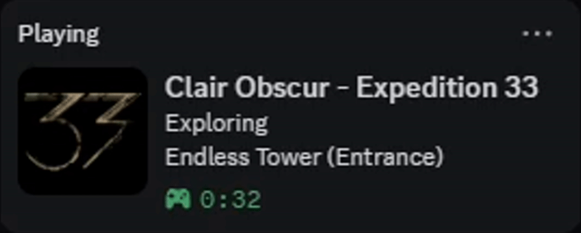
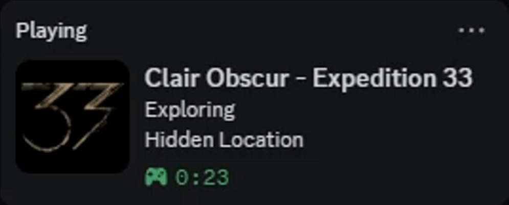

# Clair Obscur: Expedition 33 - Discord Rich Presence

[](https://github.com/SolaneHub/Expedition33_RPC/releases)
[](https://www.python.org/)
[](https://www.microsoft.com/windows)
[](https://github.com/astral-sh/ruff)
[](https://github.com/microsoft/pyright)
[](LICENSE)
[](https://github.com/SolaneHub/Expedition33_RPC/releases/latest)

A lightweight, autonomous Windows background application providing rich, dynamic **Discord Rich Presence (RPC)** for ***Clair Obscur: Expedition 33***. It resides discreetly in your Windows system tray, continuously detects your live gameplay state without performance overhead, and reflects detailed in-game locations, turn-based battle encounters, Expedition Flags, and Endless Tower trials directly on your Discord profile.

---

## Discord Status Showcase

| Exploration & Battle | Endless Tower Trials | Anti-Spoiler Shield |
| :---: | :---: | :---: |
|  |  |  |
| Live dynamic transition from zone exploration (`Spring Meadows`) to turn-based battle (`Fighting: Lancelier`). | Real-time stage and trial progression (`Stage 1, Trial 1`) with multi-enemy encounter targeting. | Instant one-click tray shield masking locations (`Hidden Location`) and encounters (`In Combat`). |

---

## What Appears on Your Discord Profile

The status adjusts dynamically depending on whether your game language is set to **English** or **Italian**:

| State | Details (Top Line) | State (Bottom Line) | Image Tooltip | Elapsed Timer |
| :--- | :--- | :--- | :--- | :--- |
| **Exploration (EN)** | `Exploring` | `<Zone Name> (<Flag Name>)` *(e.g. `Sirene (Dancing Classes)`)* | `Clair Obscur: Expedition 33` | Active session duration |
| **Exploration (IT)** | `In esplorazione` | `<Nome Zona> (<Nome Bandiera>)` *(es. `Sirène (Dancing Classes)`)* | `Clair Obscur: Expedition 33` | Durata sessione attiva |
| **Combat Encounter (EN)** | `Fighting: <Enemy / Boss>` | `<Zone Name> (<Flag Name>)` | `Clair Obscur: Expedition 33` | Active session duration |
| **Combat Encounter (IT)** | `In combattimento con: <Nemico>` | `<Nome Zona> (<Nome Bandiera>)` | `Clair Obscur: Expedition 33` | Durata sessione attiva |
| **Endless Tower (EN)** | `Fighting: <Boss / Enemy>` | `Endless Tower (Stage <X>, Trial <Y>)` | `Clair Obscur: Expedition 33` | Active session duration |
| **Endless Tower (IT)** | `In combattimento con: <Boss>` | `Torre Infinita (Fase <X>, Prova <Y>)` | `Clair Obscur: Expedition 33` | Durata sessione attiva |
| **Anti-Spoiler Enabled** | `In Combat` / `In combattimento` | `Hidden Location` / `Posizione riservata` | `Clair Obscur: Expedition 33` | Active session duration |

> [!TIP]
> **Process PID Binding**: The Discord Rich Presence client is bound directly to the live game executable (`SandFall-Win64-Shipping.exe`). Discord attaches your custom Rich Presence status directly to the running game instance, preventing conflicting dual statuses.

---

## Key Features

- **Continuous Autonomous Detection**: Runs quietly in the system tray and establishes a Discord Rich Presence session the moment `SandFall-Win64-Shipping.exe` begins running, cleanly disconnecting when the game closes.
- **Dual-Engine Detection Pipeline**:
  - **Tier 1 (Real-Time Game Thread Bridge)**: A headless, non-intrusive Lua bridge powered by [UE4SS](https://github.com/UE4SS-RE/RE-UE4SS) that hooks directly into `AC_jRPG_BattleManager_C` on the game thread. Detects battle transitions in 0 milliseconds and extracts live enemy/boss titles without memory scanning.
  - **Tier 2 (Binary Save File Parser)**: Reads `SavesContainer.sav` and `EXPEDITION_0.sav` with multi-tier fuzzy zone validation as a fallback whenever the bridge is not active.
- **Exhaustive Expedition Flag Mapping**: All **115 official in-game Expedition Flags** across **48 zones** (from *Spring Meadows* to *The Monolith*, *Verso's Drafts*, and *The Reacher*) are mapped with sub-area disambiguation and multi-tier resolution.
- **Official Zone Normalization**: Translates raw internal Unreal Engine map assets (`Level_Goblu_Main` -> *Flying Waters*, `Level_SeaCliff` -> *Stone Wave Cliffs*, `Level_CleasFlyingHouse` -> *Flying Manor*, `Level_SimonArea` -> *The Abyss*) into clean player-facing names.
- **Endless Tower & Super Boss Intelligence**: Automatically resolves trials, stages, and Super Bosses (*Simon the Divergent Star*, *Clea Unleashed*, *Duollistes*, *Painted Love*).
- **Unified Anti-Spoiler Mode**: One-click tray toggle to shield against spoilers when streaming or playing with friends.
- **Built-In Silent Auto-Updater**: Checks GitHub Releases API in the background on startup, verifies SHA-256 integrity, and performs a 100% invisible in-place self-update with automatic app restart via a native Windows PowerShell trampoline.
- **Windows Startup Integration**: Toggle automatic launch on Windows startup directly from the tray icon (`HKCU\...\Run`).

---

## Installation & Quick Start

1. Download the latest `Expedition33_RPC.exe` from [Releases](https://github.com/SolaneHub/Expedition33_RPC/releases).
2. Run `Expedition33_RPC.exe`. It minimizes to your Windows system tray near the clock.
3. Start *Clair Obscur: Expedition 33*. Your Rich Presence will update automatically on Discord.

### How to Prioritize Your Custom Rich Presence in Discord

Because Discord has a global database of verified games, its automatic process scanner might show a generic *"Playing Clair Obscur: Expedition 33"* without details. To make Discord display **100% of your detailed custom Rich Presence**:
1. In Discord, click **User Settings** (gear icon in the bottom-left).
2. Go to **Activity Privacy** / **Registered Games**.
3. Under the detected games list, locate **Clair Obscur: Expedition 33** (or the game executable) and click the **monitor/eye icon** to toggle it off.
4. Keep the main toggle *"Display current activity as a status message"* enabled. Discord will now exclusively show the rich status from `Expedition33_RPC`.

---

## Technical Architecture

The codebase follows a modular 4-tier architecture designed for separation of concerns and high testability:

```text
src/expedition33_rpc/
├── __init__.py               # Re-exports GameDetector, GameState, main, __version__
├── __main__.py               # CLI entrypoint (`python -m expedition33_rpc`)
│
├── core/                     # Application lifecycle, settings & system startup
│   ├── app.py                # Main loop, single-instance mutex & event orchestration
│   ├── settings.py           # Persistent configuration management (Anti-Spoiler)
│   └── startup.py            # Windows Registry autostart integration
│
├── detection/                # Game process, memory, save files & zone tracking
│   ├── detector.py           # GameDetector with polymorphic state providers
│   ├── game_data.py          # 115 Expedition Flags, zone overrides & trial tables
│   ├── save_reader.py        # Binary Unreal Engine .sav file reader & validator
│   └── timer_tracker.py      # ZoneTimerTracker for smooth timer persistence
│
├── integrations/             # External services & installers
│   ├── discord_rpc.py        # Discord Rich Presence manager via pypresence IPC
│   ├── bridge_installer.py   # Automatic UE4SS combat bridge deployment
│   └── updater.py            # In-app semi-automatic updater with SHA-256 verification
│
├── ui/                       # Graphical user interface
│   └── tray_app.py           # Windows System Tray icon, menu & notifications
│
└── assets/                   # Static resources
    ├── bridge.zip            # Pre-compiled headless UE4SS mod package
    ├── icon.ico              # Windows executable icon
    └── icon.png              # System tray & notification icon
```

---

## System Tray Controls

Right-clicking the tray icon gives you full control and real-time diagnostic status:

| Menu Option | Description |
| :--- | :--- |
| `Game: Running (PID: X) / Not running` | Live status and process ID of the game executable |
| `Location: <Zone Name>` | Current map/zone (`[Hidden - Anti-Spoiler]` when enabled) |
| `Status: In Combat / Exploring` | Real-time combat state and active target name |
| `Discord: Connected / Standby` | Discord IPC pipe connection status |
| `Anti-Spoiler Mode [Enabled / Disabled]` | Toggles obscuring enemy names and location zones |
| `Combat Bridge [Installed / Install Now]` | Toggles deployment of the headless UE4SS combat bridge |
| `Start with Windows [X / ]` | Toggles automatic launch on Windows login via registry |
| `Check for Updates` / `Update to vX.X.X` | Checks for releases and applies one-click self-update |
| `Exit` | Disconnects Discord RPC and terminates the background process |

---

## Security, Verification & Antivirus Transparency

All binaries published in [Releases](https://github.com/SolaneHub/Expedition33_RPC/releases) are built automatically in clean virtual machines via GitHub Actions.

### Automated VirusTotal Inspection
Every compiled executable published under GitHub Releases is automatically submitted to and analyzed by [VirusTotal](https://www.virustotal.com/) across 70+ antivirus engines (including Microsoft Defender, Kaspersky, Bitdefender, etc.) directly during the release build:
- **Scan Report Access**: Every [GitHub Release](https://github.com/SolaneHub/Expedition33_RPC/releases/latest) includes the direct, permanent VirusTotal report link for that exact binary build.
- **Continuous Transparency**: You can inspect the live scan results before downloading any release.

### Cryptographic Verification (SHA-256)
Every release comes with a `SHA256SUMS.txt` checksum file. You can verify your download locally in PowerShell:
```powershell
Get-FileHash .\Expedition33_RPC.exe -Algorithm SHA256
```
Compare the resulting hash with the hash listed in `SHA256SUMS.txt`.

### Antivirus & False Positive Notes
- **PyInstaller Bundles**: The application is packaged into a single standalone `.exe` using PyInstaller. Some heuristic scanners occasionally flag unsigned open-source PyInstaller binaries as generic false positives.
- **Automated VirusTotal Scans**: Releases are automatically scanned across 70+ antivirus engines on VirusTotal, with permanent scan links published directly in the release notes.
- **Windows SmartScreen**: Because the executable is an open-source binary without an expensive corporate EV certificate, Windows SmartScreen may show a warning on first launch. Click **More info** -> **Run anyway**.

---

## Development & Building

### 1. Requirements
- Python 3.10+
- [uv](https://docs.astral.sh/uv/) (recommended package and project manager)

### 2. Setup Virtual Environment
```bash
uv sync
```

### 3. Code Quality & Linting
```bash
# Lint checks
uv run ruff check

# Format check / auto-format
uv run ruff format

# Static type checking
uv run pyright
```

### 4. Build Standalone Executable Locally
```bash
uv run python build_exe.py
```
The compiled binary will be placed in `dist/Expedition33_RPC.exe`.

---

## License

This project is licensed under the [MIT License (with Attribution)](LICENSE) - see the [LICENSE](LICENSE) file for details. Any redistribution, fork, or derivative work must retain prominent attribution to the original author (SolaneHub) and include a visible link back to the project repository.

Clair Obscur: Expedition 33 is a trademark of Sandfall Interactive / Kepler Interactive. This application is an unofficial, community-made tool and is not affiliated with or endorsed by Sandfall Interactive.
